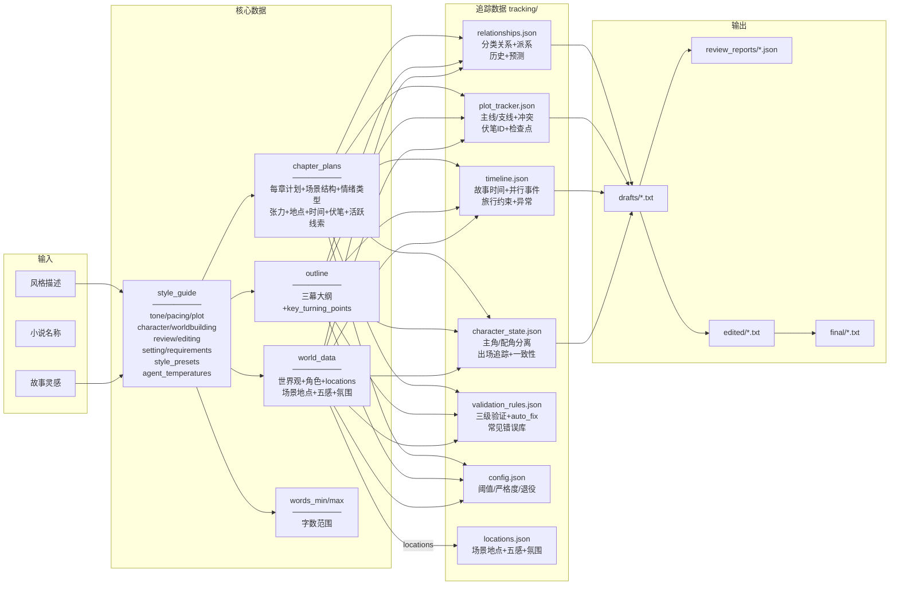
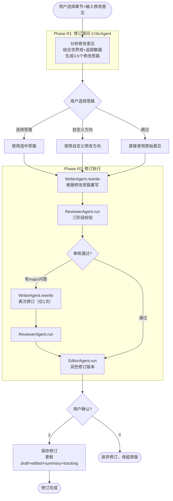

# XYR_test 完整流程图

> 本文档**仅记录系统运行时的流程和数据流向**（用 Mermaid 图表达）。
> 字段链路细节请查阅 `docs/system_reference.md`，参数与硬编码常量请查阅 `docs/parameters_and_changelog.md`，AI 验证协议请查阅 `docs/verification_protocol.md`。
> **接到需求的执行流程请先读 `docs/execution_workflow.md`**。
>
> *最后验证：2026-05-23*

## 主流程

```mermaid
flowchart TD
    START([用户输入：灵感+书名+风格]) --> P0

    subgraph P0["Phase 0: 风格顾问 StyleAdvisorAgent"]
        P0A[requirement-detector<br/>8种写作规范探测] --> P0B
        P0B[setting-detector<br/>7种题材+3个知识库] --> P0C
        P0C[style-detector<br/>5种文风+冲突矩阵] --> P0D
        P0D[动态温度推荐<br/>agent_temperatures]
    end

    P0 --> |style_guide JSON| TEMP[_apply_style_temperatures<br/>设置各Agent温度]
    TEMP --> P05

    subgraph P05["Phase 0.5: 交互式参数收集"]
        P05A[展示风格建议<br/>章数/字数/节奏] --> P05B
        P05B{用户确认<br/>或覆盖参数?}
        P05B --> |确认| P05C[保存参数]
    end

    P05 --> P1

    subgraph P1["Phase 1: 导演 一次性生成+全量精修"]
        P1A[director.run → 一次性生成<br/>世界观+角色+地点+大纲] --> P1B
        P1B[全量精修<br/>合并为完整 JSON<br/>是/调整/重写<br/>每次 LLM 返回完整 JSON<br/>确保跨 block 一致性]
    end

    P1 --> |holistic ✓<br/>world.json / outline.json| P2

    subgraph P2["Phase 2: 编剧 PlotAgent"]
        P2A[章节拆分] --> P2B
        P2B[剧情要点+情绪线] --> P2C
        P2C[伏笔+场景结构<br/>scene_structure<br/>tension_level]
    end

    P2 --> |chapters.json| P25

    subgraph P25["Phase 2.5: 追踪系统初始化"]
        P25A[character_state.json<br/>主角/配角分离+出场追踪+一致性]
        P25B[timeline.json<br/>故事时间+并行事件+旅行约束+异常]
        P25C[plot_tracker.json<br/>主线/支线+冲突+伏笔ID+检查点]
        P25D[relationships.json<br/>分类关系+派系+关系矩阵+预测]
        P25E[validation_rules.json<br/>三级验证+auto_fix+常见错误]
        P25F[config.json<br/>阈值/严格度/退役/禁用检查]
        P25G[locations.json<br/>场景地点+五感+氛围指南]
    end

    P25 --> P3

    subgraph P3["Phase 3: 逐章写作循环"]
        P3START[第N章开始] --> CHECK
        CHECK[_pre_write_check<br/>8项数据完整性检查]
        CHECK --> TRACK
        TRACK[构建追踪上下文<br/>get_tracking_context]
        TRACK --> FORGOT
        FORGOT{遗忘检测<br/>角色/支线/伏笔}
        FORGOT --> |有遗忘| REPORT[报告遗忘元素]
        FORGOT --> |无遗忘| CTX
        REPORT --> CTX
        CTX[构建运行上下文<br/>世界观+大纲+前文摘要+追踪数据]
        CTX --> WRITE

        WRITE[WriterAgent.run<br/>对话技巧+场景结构]
        WRITE --> DRAFT[保存草稿]
        DRAFT --> FIX1

        FIX1[auto_fix<br/>角色名+常见错误修正]
        FIX1 --> FIX2
        FIX2[auto_fix_banned_words<br/>禁用AI词替换]
        FIX2 --> DRAFT2[保存修正后草稿]
        DRAFT2 --> REVIEW

        REVIEW[ReviewerAgent.run<br/>三阶段一致性校验]
        REVIEW --> |consistency_score<br/>auto_fix_suggestions| PASS
        PASS{审核通过?}
        PASS --> |不通过<br/>major问题| REWRITE
        REWRITE[WriterAgent.rewrite<br/>根据反馈重写]
        REWRITE --> REVIEW
        PASS --> |通过| SUMMARY

        SUMMARY[生成章节摘要<br/>generate_chapter_summary]
        SUMMARY --> UPDATE
        UPDATE[更新追踪数据<br/>appearanceTracking<br/>lastSeen/timeline/foreshadowing]
        UPDATE --> SAVE[保存状态]
        SAVE --> NEXT{还有下一章?}
        NEXT --> |是| P3START
    end

    NEXT --> |否| P4

    subgraph P4["Phase 4: 编辑润色"]
        P4A[读取草稿] --> P4B
        P4B[注入追踪上下文<br/>get_tracking_context] --> P4C
        P4C[前后章过渡衔接] --> P4D
        P4D[EditorAgent.run<br/>style_guide按角色过滤]
        P4D --> P4E[保存润色稿]
        P4E --> P4NEXT{还有下一章?}
        P4NEXT --> |是| P4A
    end

    P4NEXT --> |否| P5

    subgraph P5["Phase 5: 合并输出"]
        P5A[逐章保存到 final/] --> P5B
        P5B[合并为全文<br/>书名_全文.txt]
    end

    P5 --> DONE([创作完成！])
```



## 数据流



## 写作循环详细流程

```mermaid
flowchart TD
    START([开始第N章]) --> CHECK

    subgraph 准备阶段["写前准备"]
        CHECK[① _pre_write_check<br/>检查8项数据完整性]
        CHECK --> TC[② get_tracking_context<br/>角色状态/时间线/伏笔/关系/冲突/异常/警告]
        TC --> FG[③ check_forgotten<br/>角色10章 / 支线12章 / 伏笔20章]
        FG --> CTX[④ build_running_context<br/>世界观(9类字段)+大纲(含转折点)<br/>前文摘要+追踪数据+章节计划(15字段)]
    end

    CTX --> WRITE

    subgraph 写作阶段["写作+修正"]
        WRITE[⑤ WriterAgent.run<br/>含对话技巧+场景-续场模型]
        WRITE --> SAVE1[保存原始草稿]
        SAVE1 --> AF[⑥ auto_fix<br/>角色名别名+常见错误修正]
        AF --> BF[⑦ auto_fix_banned_words<br/>6层禁用词替换]
        BF --> SAVE2[保存修正草稿]
    end

    SAVE2 --> REV

    subgraph 审核阶段["三阶段校验"]
        REV[⑧ ReviewerAgent.run]
        REV --> R1[Phase 1: 并行校验<br/>角色一致性+世界观+时间线]
        R1 --> R2[Phase 2: 深度校验<br/>名称/称呼/言语模式/行为自洽]
        R2 --> R3[Phase 3: 综合评估<br/>consistency_score 0-100<br/>auto_fix_suggestions]
    end

    R3 --> DEC{approved?}
    DEC --> |否 + major| LOOP[⑨ WriterAgent.rewrite<br/>最多重试N次]
    LOOP --> REV
    DEC --> |是| POST

    subgraph 后处理["章后处理"]
        POST[⑩ generate_chapter_summary<br/>生成摘要供后续章节使用]
        POST --> UPD[⑪ update_tracking<br/>角色出场记录/lastSeen<br/>timeline更新<br/>伏笔planted标记]
        UPD --> SAVE3[保存状态<br/>断点续写支持]
    end

    SAVE3 --> NEXT{下一章?}
    NEXT --> |是| START
    NEXT --> |否| EDIT([进入编辑阶段])
```

## 修订流程（revise 命令）



## 文件结构

```
output/<小说名>/
├── novel_state.json          # 全局状态（断点续写）
├── world.json                # 世界观设定
├── outline.json              # 故事大纲
├── chapters.json             # 章节规划
├── tracking/                 # 全量追踪数据
│   ├── character_state.json  #   主角/配角状态+出场追踪+一致性
│   ├── timeline.json         #   故事时间+并行事件+旅行约束+异常
│   ├── plot_tracker.json     #   主线/支线+冲突+伏笔ID+检查点
│   ├── relationships.json    #   分类关系+派系+关系矩阵+预测
│   ├── validation_rules.json #   三级验证+auto_fix+常见错误
│   ├── locations.json        #   场景地点+五感+氛围指南
│   ├── config.json           #   阈值/严格度/退役/禁用检查
│   └── tracking_changes.csv  #   变更日志（每章追踪数据变化）
├── drafts/                   # 原始+修正草稿
├── review_reports/           # 审核报告（含consistency_score）
├── edited/                   # 润色后章节
└── final/                    # 最终版 + 全文合并
```
